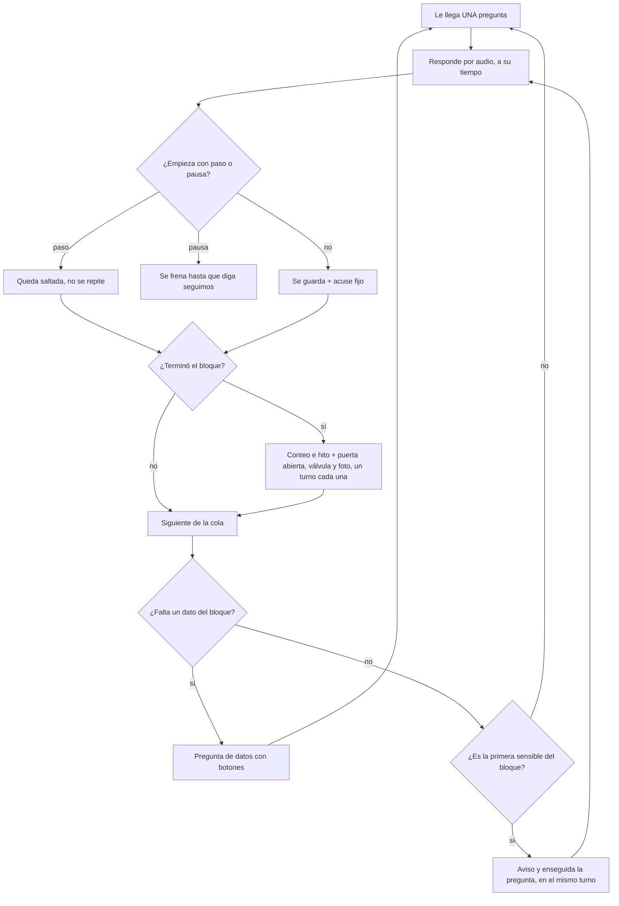

# Vitácora Familiar V3 — entrevistador y escritor

**Estado: Borrador para aprobar — 25/09/2026.**

**Resumen**

1. La V3 se hace desde cero: entrevistador y escritor nuevos. No se parchea el esqueleto v2.
2. La entrevista no tiene un modelo que lea lo que contó el narrador. Es un banco fijo de preguntas que piden escenas. Lo único personal son los datos de la ficha.
3. No hay repregunta. Lo que un lector necesita (cómo terminó, qué fue de esa persona) va como pregunta propia. Al cerrar cada bloque, el narrador elige qué ampliar.
4. Ritmo por turnos: el narrador tiene siempre una sola pregunta pendiente. La siguiente llega cuando responde.
5. La ficha la carga quien regala (6 campos obligatorios, género incluido). Lo que falta se le pregunta al narrador como dato, con botones.
6. Termina la entrevista → el narrador ve en el dashboard sus respuestas transcriptas tal cual y corrige lo que quiera (nombres, datos, sacar respuestas) → recién ahí se escribe el libro, una vez.
7. El escritor es un solo modelo en 4 pasos, con controles de código. La pasada única de Naza se compara en la prueba.
8. El Estándar reparte las preguntas por etapa vivida: al menos 6 por etapa (infancia, escuela, adolescencia, juventud), 8 si el narrador tiene menos de 45. Vida típica de 60+: 102 con puertas. Joven de 29 sin pareja ni hijos, emigrado: 82 de historia, 95 con puertas.
9. No se gasta en modelos hasta pasar E3 y E4. El escritor se prueba (E7) sobre una sola historia, la de Naza: primero dentro de la sesión, sin gastar API, con los mismos prompts que irían a la API; por API, ~USD 5–6.

El banco completo está en [`banco-v3.md`](banco-v3.md).

---

## 1. Por qué una V3

- **El entrevistador leía mal el contexto.** Decía "ayer", mezclaba hermanos, devolvía detalles que el narrador ya había dicho (informe 1). Un modelo leyendo contexto trae esta clase de error. Pasa aunque el prompt sea mejor.
- **El libro era un pegoteo.** Personas presentadas dos veces, momentos en el capítulo equivocado, anécdotas repetidas, frases sueltas, títulos por lugar ("La casa de la calle X") (informe 1).
- **Salían resúmenes, no escenas.** En E1 solo el 15 % de las respuestas eran escenas, y 6 de las 9 escenas vinieron de un piloto viejo con repregunta.
- **El escritor perdía material.** De 10 huecos que Naza reclamó, 5 estaban en lo que había contado (E1).
- **Nombres mal transcritos.** 5 % de las menciones (16 de 322) en E1, más 8 ya corregidos. Ejemplos del informe 2: Meri → Mary, Chiara → Kiara, Cordovero → Cordobero.
- **Audios bajo la pregunta equivocada.** 4 respuestas quedaron guardadas en la pregunta que no era (E1). También había preguntas que pedían dos cosas ("una foto de las fiestas o del estudio") y cruzaban epígrafes (informe 1).

## 2. Decisiones de Naza

Mandan sobre los informes. Donde un informe dice otra cosa, gana esto.

| Tema | Decisión |
|---|---|
| Punto de partida | V3 desde cero, entrevistador y escritor. No se parchea el v2. No se corren modelos pagos hasta saber si vale la pena. El escritor se prueba sobre una sola historia: la de Naza, con sus 32+ respuestas completas. |
| Cómo se pregunta | Sin modelo que lea el contexto. Banco fijo de preguntas que piden escenas ("contame una vez / el día que… qué pasó, quién estaba"), con "decí *paso*" si no aplica. Única personalización: nombres y datos de la ficha en `{{campos}}`. |
| Repregunta | No hay. Si contesta poco, es lo que dijo. Lo que un lector necesita va como pregunta propia del banco. Tema abierto: se revisa con datos de gente mayor. Se mantiene la válvula "más" al cerrar cada bloque. |
| Ritmo | Por turnos, no por días ni por cupo semanal. Responde → llega la siguiente. Siempre una sola pendiente. Los audios que llegan con la pregunta abierta se suman a la misma respuesta; la siguiente llega sola a los 3-5 minutos sin audios nuevos, o antes con el botón [Siguiente]. Responde a su tiempo. Recordatorio suave si pasan días. Puede decir "pausa". |
| Ficha | La carga quien regala. Obligatorio: nombre (y cómo le dicen), año de nacimiento, país, para quién es el libro (y qué es del narrador), género. Lo demás es opcional con tres estados: lleno / "no tiene" / "no sé". País de nacimiento y de residencia por separado. Oficio: "a qué se dedica / se dedicó", con opción "trabajó en su casa". Campos nuevos del informe 3. "Temas que no tocar". Otros nombres con grafía. |
| Datos que faltan | Primero la ficha. Si falta, se le pregunta al narrador como dato al abrir el bloque: botones o primera palabra del audio. En las de datos sí se piden varias cosas juntas. También se le puede pedir a quien regala por mail. Si igual no hay dato: versión genérica, solo en preguntas no sensibles. |
| Dashboard y escritura | Orden fijo (25/09): termina la entrevista → el narrador ve en el dashboard sus respuestas transcriptas tal cual y corrige lo que quiera (nombres, datos, sacar respuestas) → recién ahí se escribe el libro, una vez. Los nombres los corrige el narrador (es su historia); el sistema los junta por reglas, no por modelo, con clip de audio y "qué es tuyo". Retranscribir con la lista (~USD 1): propuesta a validar con E3. |
| Sentirse escuchado | Aprobado: biógrafo con nombre y voz, nombres de la ficha, acuses cálidos fijos (set sobrio para pérdidas y legado), avance a la vista con progreso dotado desde el primer mensaje, elegir el tema del turno siguiente entre 2, reacciones de la familia, preguntas de la familia, conteos sin contenido, preguntas grabadas con voz humana. Descartado: párrafos de su libro mientras narra, capítulo de mitad de programa, que el biógrafo comente o resuma, rachas y medallas. |
| Sensibles | Solo con dato confirmado (ficha o botón). Excluibles desde la ficha. "Paso" siempre. Acuse sobrio. El aviso va justo antes de la primera sensible del bloque, en el mismo turno. Una vez por bloque. |
| ID1 | Se suma ("¿Hubo una parte de vos que tuviste que esconder durante años?…"): sensible, Estándar. |
| Temas nuevos | Oficio, pasiones y hobbies, una ayuda recibida, una traición (textos del informe 3). Pandemia: pregunta fija, fuera del menú de HG1 (**confirmada por Naza (25/09)**). Mundial (25/09): deja de ser pregunta fija y vuelve al menú de HG1 (Argentina: 78, 86, 2022). |
| Lo militar | (25/09) En vez de "servicio militar": "¿Tuviste alguna experiencia con lo militar: la colimba, la mili, un colegio militar, alguien de tu familia en las fuerzas?" [Sí] [No]. Si Sí: un día de esa experiencia (Estándar) y, en Completo, alguien que conoció ahí. Sin condición de género ni de edad. |
| Tamaños | Breve (~50 preguntas, libro breve ~45 páginas), Estándar (~95 enviadas para una vida típica, ~70 páginas), Completo (~145). No se prometen páginas fijas: varían con la vida. **Estándar balanceado por etapa vivida (25/09):** cada etapa vivida (infancia, escuela, adolescencia, juventud) recibe al menos 6 preguntas de historia; con menos de 45 años, al menos 8, porque no hay adultez que contar. Resultado: vida típica 60+ = 102 con puertas; joven de 29 = 82 de historia (objetivo 70–85), 95 con puertas. |
| Escritor | Un modelo en 4 pasos: biblia → plan → capítulos → lectura de continuidad. Controles de código: nombres, años, citas, personas presentadas una vez. Cronológico con marco. Capítulos con apertura, giro y remate. Títulos por etapa o frase propia, nunca por lugar solo. Citas clean verbatim, pocas y verificadas. Nunca estirar. La pasada única de Naza es un brazo de la prueba. |
| Arquitectura | No son "agentes" autónomos. Es una cadena fija de roles controlada por código. |

## 3. Cómo funciona la entrevista

### Roles

Cadena fija. El código decide todo; ningún rol decide qué se pregunta.

| Rol | Qué hace | ¿Usa modelo? |
|---|---|---|
| Biógrafo | Manda la pregunta que toca del banco, las de datos, los acuses, avisos, conteos y pedidos de foto. Lee "paso" y "pausa" en las primeras palabras. | No. Solo reglas. |
| Transcriptor | Pasa cada audio a texto con marcas de tiempo por palabra. Usa los nombres de la ficha como lista de términos. | Sí: el STT. |
| Juntador de nombres | Arma la lista de nombres propios de todos los audios para que el narrador la corrija. | No. Reglas: palabras con mayúscula que no abren oración, marca de nombre propio del STT si existe, agrupadas por parecido ("Meri / Mary / Mari"). |
| Escritor | Arma el libro en 4 pasos (sección 6). | Sí: un modelo. |

### El flujo, turno por turno

Si pasan días sin respuesta, llega un recordatorio suave (cuántos días: a decidir). Nunca se acumulan preguntas.

- **Orden.** Bloques cronológicos del 1 al 15. Dentro del bloque, el orden del banco. El turno siguiente puede ofrecer dos temas con botones; lo obligatorio no elegido vuelve a la cola.
- **Cierres de lector.** Van en el turno siguiente a su pregunta madre. Si la madre fue "paso", no se mandan.
- **Preguntas de la familia.** Entran a la cola con "Esta te la manda tu hijo Pablo". Las escribe un humano.
- **Varios audios en una respuesta:** se suman a la misma respuesta mientras la pregunta está abierta; la siguiente llega sola a los 3-5 minutos sin audios nuevos, o antes con [Siguiente] (P1, aprobada).

### Datos y gates

Un gate es un dato que decide si una pregunta se manda. Se resuelve siempre en este orden, sin modelo:

1. **Ficha.** Si el campo está lleno o dice "no tiene", está resuelto.
2. **Pregunta de datos al abrir el bloque**, con botones de WhatsApp (hasta 3): "¿Tuviste hermanos?" [Sí] [No]. Para oficio: [Trabajé afuera] [En mi casa] [Las dos]. Si contesta por audio, vale la primera palabra.
3. **Mail a quien regala** para lo que falte (cómo y cuándo: tema abierto).
4. **Versión genérica**, solo en preguntas no sensibles. Una sensible sin dato no se manda.

Hay datos que van **solo por ficha**, sin botón: hijo fallecido, persona importante, enfermedad larga, temas que no tocar. Preguntarlos por botón sería una intromisión.

Las 16 preguntas de datos, con sus botones, están en el banco.

### Sensibles

- Solo con el dato confirmado (ficha o botón). Nada de "si murió…" genérico.
- Se pueden excluir desde la ficha.
- "Paso" siempre vale.
- Aviso fijo, **en el mismo turno**, justo antes de la primera sensible del bloque. Una vez por bloque. Texto: "Las próximas preguntas son sobre momentos difíciles. Podés decir *paso* en cualquiera."
- Después, acuse del set sobrio.
- Sensibles universales (no presumen nada; preguntan "una vez que"): PE3, PE4, PE5, PE6, PE8, CR1, ID1, HJ7.
- Si el narrador nombra a alguien en PE8 (traición), ese nombre entra al libro solo si se confirma en la lista de nombres; si no, "una persona cercana" (informe 3).

### Sentirse escuchado

Sin que un modelo interprete nada. Todo es número, nombre de la ficha, botón o voz de la familia.

| Mecanismo | Cómo |
|---|---|
| Biógrafo con nombre y voz | Siempre habla igual. Misma voz en las preguntas grabadas. Nombre: a decidir. |
| Nombres de la ficha | "Contame el día que conociste a Marta." Los nombres del audio sin confirmar entran como los escribió la transcripción hasta la revisión. |
| Acuses cálidos fijos | 8–10 frases que rotan, sin contenido. Set sobrio para sensibles y legado. |
| Avance a la vista | Barra por etapas, "tu libro ya tiene N páginas". Progreso dotado desde el primer mensaje: portada, dedicatoria y línea de tiempo salen de la ficha. |
| Elegir el tema | Dos opciones por botón para el turno siguiente. |
| Reacciones de la familia | Un corazón o un audio corto de un familiar, reenviado con mensaje fijo. |
| Preguntas de la familia | "Esta te la manda tu hijo Pablo." |
| Conteos | "En esta etapa contaste 9 historias y nombraste a 6 personas." |
| Voz humana | Las preguntas del banco se graban una vez. Los nombres no se pueden pregrabar: van como texto debajo del audio, o con voz sintética solo para el nombre (informe 2; a decidir). |

### Fotos

- **Un pedido por turno.** Nunca dos cosas en un pedido.
- **Una sola foto.** Si manda dos, se queda la primera y se le avisa con mensaje fijo.
- **Epígrafe por audio.** Cada pedido termina con "contame en un audio quiénes están, dónde es y de qué año más o menos". Ese audio es el epígrafe.
- Van al cerrar el bloque, atados a un tema ya preguntado. Son 14 pedidos posibles; con 8–10 fotos el libro se arma bien (informe 1). Tabla en el banco.

### Dashboard: revisión antes de escribir

Orden fijo (decisión de Naza, 25/09). El libro no se escribe hasta que el narrador terminó de revisar.

1. **Termina la entrevista.**
2. **Se arma la biblia** (paso 1 del escritor). Todavía no se escribe nada del libro.
3. **Pantalla de revisión en el dashboard** (aprobada por Naza el 25/09, salió de la prueba del escritor): el escritor no adivina nada; lo que no está claro, lo decide el narrador. Todo junto, en pocos minutos:
   - **Sus respuestas tal cual**, pregunta por pregunta, con el audio al lado. Corrige errores de transcripción ("Llevamos" → "Llegamos") y datos, y saca las respuestas que no quiere en el libro (por eso se descartó el "esto no lo pongas" por WhatsApp).
   - **Nombres.** El Juntador arma la lista de nombres de todos los audios, por reglas, más los "nombres dudosos" de la biblia. Por cada nombre: cómo lo escribió la transcripción, cuántas veces aparece, un clip de unos 3 segundos del audio, y "qué es tuyo" (hermano/a, amigo/a, pareja, jefe, vecino, otro, no sé). Corrige la grafía, marca la relación, descarta falsos positivos con un clic.
   - **Tus frases.** Las citas candidatas de la biblia. Saca las que no le gustan y agrega las que quiere. Una cita mal dicha va al libro solo si él la deja.
   - **Dudas.** Las contradicciones y deducciones de la biblia, como preguntas cortas con botones: "¿El viaje de egresados fue con Vicky?" [Sí] [No, con ___]; "¿El hermano que trabajaba en Cancillería era Ariel?".
   - **Contenido delicado.** Lo que la biblia marca como posiblemente delicado para la familia (cárcel, drogas, negocios, sexo): "¿Querés que esto esté en el libro?" [Sí] [No] [Contarlo más suave].
   - **Tu línea de tiempo.** Su vida en orden con edades aproximadas, para confirmar el orden.
   - **Fotos.** Cada foto con su epígrafe y el capítulo donde va; la puede mover.
4. Propuesta a validar con E3: retranscribir todo con la lista de nombres confirmada (~USD 1).
5. **Recién ahí se escriben el plan y los capítulos. Una sola vez.** La biblia se ajusta con lo que confirmó (sin volver a llamar al modelo si alcanza con editar el JSON).

Después del libro: ver "Revisión del PDF" en temas abiertos (recomendación de Claude).

## 4. La ficha

La carga quien regala en la compra. Queda en el dashboard y se puede editar.

**Estados de los opcionales:** *lleno* (resuelve el gate), *no tiene* (resuelve el gate en negativo y habilita las preguntas "sin": hijo único, sin pareja, sin hijos), *no sé* o vacío (dispara la pregunta de datos al abrir el bloque).

| Campo | Obligatorio | Estados | Para qué |
|---|---|---|---|
| Nombre completo, con grafía exacta, y cómo le dicen | Sí | lleno | Portada, `{{nombre}}`, `{{apodo}}` (OR6.2), primer término para el STT |
| Género: varón / mujer / otro, y cómo prefiere que le hablen | Sí | lleno | `{{o/a}}` en todo el banco |
| Año de nacimiento | Sí | lleno | Variantes por edad (E:45+, E:60+, E-joven), línea de tiempo |
| País de nacimiento | Sí | lleno | Menú de historia grande |
| País de residencia, y cómo habla (vos / tú) | Sí | lleno | Voseo o tuteo por defecto |
| Para quién es el libro: nombres y qué son del narrador | Sí | lleno | Dedicatoria, `{{destinatarios}}` (LE2, LE8), "tu nieta Juli" |
| Mamá y papá: nombres; ¿viven? | No | lleno / no tiene / no sé | `{{madre}}`, `{{padre}}`; PE1, PE2 |
| Hermanos: nombres del mayor al menor | No | lleno / no tiene / no sé | Bloque 2; CA8 si "no tiene" |
| Parejas: nombre, qué era (marido, mujer, compañero/a), actual o pasada, si terminó por separación o fallecimiento | No | lleno / no tiene / no sé | Bloque 6; `{{pareja_1}}`, `{{pareja_2}}`, `{{pareja_actual}}`; AM15 si "no tiene" |
| Hijos: nombre, hijo o hija, año; si falleció | No | lleno / no tiene / no sé | Bloque 8, una HI2/HI3 por hijo; HF1, HF2; HI10 y LE5 si "no tiene" |
| Nietos: nombres | No | lleno / no tiene / no sé | HI8, HI9 |
| Nietos a cargo: nombre | No | lleno / no tiene / no sé | NC1, NC2 |
| Lugares donde vivió: ciudad, años aproximados | No | lleno / no tiene / no sé | `{{ciudad_infancia}}`, LU2 |
| Migración: otra provincia, región o país; de dónde a dónde; edad | No | lleno / no tiene / no sé | JU8–JU11, MI1; `{{lugar_origen}}`, `{{lugar_destino}}` |
| Vivió o trabajó en el campo | No | lleno / no tiene / no sé | CP1–CP3 |
| A qué se dedica / se dedicó (texto según edad, 1 a 4), con opción "trabajó en su casa" | No | lleno / no tiene / no sé | TR2–TR6, OB1, OB2; `{{trabajo_principal}}` |
| Dejó de trabajar | No | lleno / no tiene / no sé | TR9 |
| Estudió después del secundario; si lo terminó | No | lleno / no tiene / no sé | JU2, JU3, PR1, JU2b; JU4 si "no tiene" |
| Experiencia con lo militar: colimba, mili, colegio militar, familiar en las fuerzas | No | lleno / no tiene / no sé | JU5, JU6. Sin condición de género ni de edad |
| Religión | No | lleno / no tiene / no sé | ES9, RE1, RE2 |
| Persona importante que no entra en las categorías: nombre y cómo la describiría | No | lleno / no tiene / no sé | PI1, PI2. Solo por ficha |
| Enfermedad de largo plazo (solo si quiere que esté en el libro) | No | lleno / no tiene / no sé | EC1. Solo por ficha |
| Temas que no tocar | No | texto + preguntas sensibles excluibles | Saca preguntas o bloques |
| Otros nombres que van a aparecer (amigos, apodos, mascotas), con grafía | No | texto | Términos del STT desde el principio |

## 5. El banco

Detalle, textos, preguntas de datos, fotos y mensajes fijos: [`banco-v3.md`](banco-v3.md).

- **195 filas de historia** en 15 bloques, más 13 puertas abiertas, 12 válvulas "más", 16 preguntas de datos, 14 pedidos de foto y 20 mensajes fijos.
- Cada pregunta pide **una escena**. Las que pedían dos historias se partieron.
- Todo "pendiente de aprobación": Naza aprueba cada texto.
- **Estándar balanceado por etapa vivida** (regla de Naza, 25/09): en Estándar, cada etapa vivida (bloques 2 a 5) recibe al menos 6 preguntas de historia; si el narrador tiene menos de 45, al menos 8. Para eso se pasaron de C a E ES5, ES5b, ES6, JU2, JU4, JU12, JU12b y JU13; se sumaron JU15 (amigos de la juventud) y JU5 (lo militar); y hay 8 filas **E-joven** que entran en Estándar solo con menos de 45: CA13, CA17, ES3, ES8, AD4, AD8, JU16 y JU17. Con la ficha más flaca, cada etapa da 6 (45 o más) u 8 (menos de 45).

Filas por bloque y tamaño (B = Breve, E = entra en Estándar, C = solo Completo; la columna "menos de 45" suma las E-joven). "Estándar típica" = lo que recibe una vida típica de 60+ con hermanos, pareja actual, dos hijos y nietos. "Estándar joven" = un joven de 29, emigrado, sin pareja ni hijos, con estudios terminados (detalle de las dos fichas en el banco).

| # | Bloque | Breve | Estándar | Estándar (menos de 45) | Completo | Estándar típica | Estándar joven |
|---|---|---|---|---|---|---|---|
| 1 | Origen y raíces | 3 | 3 | 3 | 7 | 3 | 3 |
| 2 | La casa y la familia de la infancia | 6 | 7 | 9 | 18 | 6 | 8 |
| 3 | La escuela y los juegos | 3 | 6 | 8 | 12 | 6 | 8 |
| 4 | Adolescencia | 4 | 6 | 8 | 15 | 6 | 8 |
| 5 | Juventud: estudios, lo militar, migración, irse de casa | 3 | 13 | 15 | 21 | 6 | 13 |
| 6 | Amor y pareja | 5 | 18 | 18 | 20 | 10 | 1 |
| 7 | Trabajo y oficio | 6 | 13 | 13 | 23 | 10 | 11 |
| 8 | Hijos y nietos | 4 | 13 | 13 | 13 | 11 | 1 |
| 9 | Lugares y pasiones | 2 | 4 | 4 | 8 | 4 | 4 |
| 10 | Amistades y ayudas | 2 | 4 | 4 | 8 | 3 | 3 |
| 11 | Pérdidas y crisis (sensible) | 3 | 11 | 11 | 13 | 8 | 6 |
| 12 | La historia grande | 2 | 2 | 2 | 5 | 2 | 2 |
| 13 | Puntos altos, bajos y giros | 2 | 4 | 4 | 15 | 4 | 4 |
| 14 | Hoy | 2 | 3 | 3 | 8 | 3 | 3 |
| 15 | Legado y cierre | 4 | 8 | 8 | 9 | 7 | 7 |
| | **Total** | **51** | **115** | **123** | **195** | **89** | **82** |

Lo que le llega a cada ficha:

| | Típica 60+: Breve | Típica 60+: Estándar | Típica 60+: Completo | Joven 29: Breve | Joven 29: Estándar | Joven 29: Completo |
|---|---|---|---|---|---|---|
| Preguntas de historia | 48 | 89 | 160 | 40 | 82 | 143 |
| + 13 puertas abiertas | — (a decidir) | **102** | 173 | — (a decidir) | **95** | 156 |
| + 12 válvulas "más" | — (a decidir) | 114 | 185 | — (a decidir) | 107 | 168 |

- **Vida típica 60+:** el Estándar con puertas pasó de 95 a **102** (objetivo ~95, techo 105): +8 por la regla de etapas y −1 por sacar el Mundial fijo. No hizo falta compensar con los bloques de adultez.
- **Joven de 29:** **82 de historia**, dentro del objetivo 70–85; con puertas, 95. Las etapas vividas le dan 37 (antes 21). Si el objetivo era con puertas, no se llega tocando solo las etapas: sin ninguna E-joven daría 87, porque el peso está en trabajo (11) y pérdidas (6). A decidir.
- El Completo da más que los ~145 del informe 3 porque ahora hay 16 cierres de lector como filas propias y 3 preguntas partidas.

## 6. El escritor

Un solo modelo, cuatro pasos encadenados sobre el mismo material cacheado. Cada paso deja algo que el código puede revisar. Las decisiones creativas se toman en el plan, no al escribir.

### Qué recibe

Un solo documento: el material arriba, las instrucciones abajo.

- **La ficha** y la **lista de nombres confirmada por el narrador**. Para nombres, manda la lista confirmada.
- **Cada respuesta**, con su id de pregunta, bloque, etapa, duración y transcripción limpia (clean verbatim). Ordenadas por bloque e id.
- **Las saltadas**, marcadas como saltadas y sin texto: el escritor sabe que ahí no hay nada y no lo inventa.
- **Las fotos**, con su epígrafe transcrito.

### Los cuatro pasos

| Paso | Qué hace | Qué deja |
|---|---|---|
| 1. Biblia | Extrae, no escribe. Personas (nombre, alias, relación, dónde aparece, una frase de presentación con respaldo), lugares, línea de tiempo (solo años dichos o calculados de la ficha), anécdotas (juntando las que se contaron en respuestas distintas), contradicciones (se marcan, no se resuelven), 30–40 citas candidatas textuales, rasgos de voz. | JSON |
| 2. Plan | Decide qué va dónde. Prólogo en presente, 8–12 capítulos cronológicos por etapa, carta final, "Sus frases", línea de tiempo, álbum. Cada anécdota a un solo capítulo. Cada persona se presenta en un solo capítulo. Por capítulo: escena de apertura, anécdotas, giro, remate, citas, fotos, largo. | JSON |
| 3. Capítulos | Uno por llamada, en paralelo. Cada llamada tiene todo el material, la biblia y el plan. | Texto |
| 4. Continuidad | Lee el libro entero y devuelve una lista de problemas con ubicación (no reescribe el libro). Cada problema se arregla reescribiendo solo ese párrafo. Máximo dos rondas. | Lista de problemas |

### Reglas al escribir

| Permitido | Prohibido |
|---|---|
| Reordenar | Cualquier hecho, nombre, fecha, lugar, diálogo, sentimiento o motivo que no esté en el material, la biblia o la ficha |
| Juntar lo que contó en respuestas distintas sobre el mismo episodio | Rellenar las saltadas |
| Resumir en una frase lo que no da para escena | Explicar la historia grande con datos de afuera (puede decir "en los días del Mundial"; no el resultado si no lo dijo) |
| Transiciones y contexto que estén en la biblia o la ficha | Presentar a una persona que el plan presenta en otro capítulo |
| Llevar una opinión suelta al cierre de la escena a la que pertenece | Repetir una anécdota de otro capítulo |
| Parafrasear | Cerrar con "y después vino…" o anunciando la etapa siguiente |
| | Frases que repiten la pregunta ("De esa época también me quedan los vehículos") |
| | Metáforas literarias que el narrador no usaría |
| | Estirar: si el material da 45 páginas, el libro tiene 45 |

**Forma.** Primera persona, en la voz del narrador. Cada capítulo: abre en una escena concreta con lugar y año o edad, desarrolla, gira (qué cambia) y remata con una imagen o una frase suya. Nunca una lista de datos.

**Títulos.** Por etapa o años más una frase propia. Nunca un lugar solo. "1958–1965. La casa de la calle Alsina" no; "Los años del taller (1971–1984)" o "«Nunca me faltó trabajo»" sí.

**Citas.** Clean verbatim: sin muletillas ni falsos arranques, con la sintaxis del narrador, sin cambiar el sentido. Pocas: 10–18 en el cuerpo y 8–12 en "Sus frases" (números de Fable). Cada una con QR a su audio. **Decisión de Naza (25/09):** una frase mal dicha no se tira: si no sirve como cita, su contenido igual entra al capítulo contado por el escritor, solo que no entre comillas. Los errores de transcripción los corrige el narrador antes de escribir, y las citas finales las elige él en la pantalla de revisión. El plan elige citas que tengan sentido en el lugar donde caen.

**Largo.** Sale de cuánto material hay, no de un número fijo por capítulo (en la prueba, el plan pidió 1.500 palabras y el material daba 700).

**Gente con poca historia.** Solo se presenta a quien tiene algo que contar; a los demás se los nombra y listo (evita las listas "Juan Collins… Juanco Belver…").

### Controles de código

Si algo falla, vuelve al paso 4 como problema.

- **Plan:** cada anécdota asignada una vez; cada persona con un solo capítulo de presentación; ninguna cita repetida; títulos sin lugar solo; largo dentro de lo que da el material. Si falla, se reintenta con el error.
- **Nombres:** cada nombre propio del libro existe en la lista confirmada, la ficha o el material.
- **Años:** cada año de cuatro cifras está en el material, la ficha o la línea de tiempo calculada.
- **Citas:** las palabras de la cita aparecen en ese orden en la transcripción cruda entre sus marcas de tiempo (solo se permite borrar muletillas de una lista fija). Si no pasa, la cita se saca; no se retoca.
- **Presentaciones:** ninguna frase de presentación de la biblia aparece dos veces.
- **Cobertura (salió de la prueba: se perdieron la jardinería y Seven Kayne):** cada respuesta del narrador aparece en alguna anécdota de la biblia y cada anécdota en algún capítulo, o en "no usar" con un motivo. Si queda alguna sin usar, el plan se rehace.
- **Biblia contra material:** cada hecho de la biblia tiene que estar en las respuestas que cita (en la prueba, la biblia inventó "aeropuerto de Berga"). Lo que no pasa, se marca como duda para la pantalla de revisión.

### Prueba fija (regresión)

El material de Naza (57 respuestas, sin repetidos, con nombres corregidos) queda guardado **fuera del repo** como prueba estándar. Cada cambio de prompt se corre contra esa historia y se compara con la versión anterior, para saber si mejoró o empeoró y no volver a errores ya arreglados. Primero dentro de la sesión (sin API); con la API solo la corrida final que mide el costo.

### Piezas fijas

- **Prólogo:** una escena de hoy (HO1 u HO4) o del día más feliz (GI1), en presente. El último capítulo vuelve a esa escena.
- **Carta final:** LE2, LE3, LE4 o LE5, LE6 y LE8, casi textuales, reordenadas. QR al audio completo de LE8.
- **"Sus frases":** 8–12 citas con QR y una línea de contexto.
- **Línea de tiempo:** solo años dichos o calculados.
- **Álbum:** las fotos que no entraron en capítulos.
- **Dedicatoria y título:** `{{destinatarios}}`; título de LE7 si lo dio, si no lo propone el plan a partir de una cita.

### Capítulos madre, hilos y forma del libro (decisiones del 26/09)

Salió de la prueba del libro de Naza (le gustó la redacción; lo flojo fueron los capítulos) y de dos informes de Fable ([capítulos madre](https://claude.ai/artifact/HtiabAUeTQBhuqwzKDvTHA), [revisión](https://claude.ai/artifact/XiZTrwHp8MSNSVcGFCwKhK)).

**Índice fijo para todos (opción C de Fable).** Diez capítulos madre: De dónde vengo · Los primeros años · Adolescencia · Salir al mundo (o "El viaje") · Amor · Trabajo y oficio · Hijos y nietos · Mi gente y mis lugares · Lo que costó · Hoy. El índice lo calcula **código** antes de llamar al modelo:
- Cada respuesta va al capítulo de su bloque (anclada). Flotantes (historia grande, giros, puertas, válvulas) por edad: número dicho ("yo tenía N", año de 4 cifras) o **léxico fijo de etapa** ("de chico", "en la colimba", "de soltera", "cuando nació {{hijo}}" con el año de la ficha).
- Un capítulo con poco material se fusiona con su vecino, con **títulos de fusión escritos de antemano** ("Crecer", "Hacerse grande"). Uno que desborda se parte por una clave de la ficha (pareja, oficio, hijos chicos/grandes, una pasión grande). "El viaje" también se inserta si la migración fue la bisagra (cae entre dos parejas u oficios).
- El número de capítulos sale del material (Breve 5–6, Estándar 8–11, Completo 12–14). El modelo no crea, fusiona ni parte capítulos, ni titula con años.

**Cambios de Naza a la opción C:**
- **Subtítulo:** frase textual suya sacada de las respuestas de ese capítulo (no principalmente de "¿qué capítulos tendría tu vida?", porque ahí puede olvidar algo que cuenta después). Filtros: sin muerte/separación (no adelantar el final), sin nombres no presentados, sin años, 2–8 palabras. El narrador ve 3 candidatos y elige o escribe el suyo.
- **Oficio o pasión:** una pasión que coincide con un oficio (músico) va a "Trabajo y oficio"; en el dashboard cada actividad tiene [Mi oficio] [Mi pasión].
- **Las pérdidas y crisis de antes de los 25 van al capítulo de su etapa** (la cárcel del padre en la infancia), con marca de sensible (sin valoraciones ni moraleja); solo las de adulto van a "Lo que costó".

**Que sea un cuento y no un álbum:**
- **Hilos:** 2 o 3 por libro, solo de fuentes verificables (lo que dijo que es su tema en legado; lo que repite en 3+ capítulos; su giro o redención; una frase que dice más de una vez), con ≥ 3 respuestas de ≥ 2 capítulos que lo sostengan. Nunca una virtud que no dijo. Si no hay hilos verificables, el libro va sin hilos.
- **Introducción** (reemplaza la "poética libre"): escena de hoy en presente → "Antes de esto hubo otras cosas" → 4 a 7 imágenes concretas suyas de lo que viene ("Hubo una casa de tres pisos donde mi viejo cocinaba con la manteca en la cacerola…"), cosas y gestos, sin valoraciones, sin contar finales → vuelve a hoy. Lista negra de palabras cursis (legado, resiliencia, huella, camino, viaje salvo literal…). Cada remate de capítulo toca un hilo con una imagen o frase suya, nunca explicándolo.
- **Epígrafe por capítulo:** título madre / subtítulo / una frase suya con QR a su voz.
- **Aperturas que rotan** (escena, objeto, persona que entra, frase suya, un día común); dos seguidas nunca iguales; el plan elige la que le queda al material.
- **Frase puente al inicio de cada capítulo** (salto de tiempo y lugar). **Solo afirma lo que se sabe** (dicho, ficha o confirmado en el dashboard); si es un cálculo, va vago ("un tiempo después", "ya más grande"); si el dato importa, se pregunta en el dashboard. Regla general: si no está seguro, no afirma; si importa, pregunta.
- **Ritmo:** al menos dos escenas por capítulo, máximo 40 % resumen; una respuesta de menos de 60 palabras nunca es escena.
- **Nada de diálogo inventado:** solo el que el narrador citó.
- **La pregunta invisible:** control de código contra frases que repiten el texto de la pregunta.

**Personas en dos niveles:** *mención* ("mi amigo Cacho", en cualquier capítulo) y *presentación* (una vez, en el primer capítulo donde tiene historia —≥150 palabras— o en el de su rol, sin adelantar nada del futuro). El código le dice a cada capítulo a quién presenta y a quién solo nombra.

**Fotos con ojos (aprobado):** un modelo mira cada foto y anota qué se ve, detecta capturas de pantalla (la foto de Snapchat de Naza) y avisa si no coincide con lo que dijo el narrador. ~USD 0,03 por libro con Haiku.

**Dashboard (antes de escribir):** 1) Tu libro por dentro (índice, subtítulos, "unas N páginas"); 2) Cosas para confirmar (máx. 15: nombres con 3 s de audio, fechas, temas delicados agrupados, dudas de comprensión); 3) Tus actividades (oficio/pasión); 4) Tus respuestas, opcional (el texto tal cual, para corregir). Botón "Dejá todo como está"; si no entra en 5 días, se escribe con lo que hay. Duda "importante" por regla: nombre de persona con historia, año de la línea de tiempo, sensible, o contradicción ficha/audio.

**Controles de código antes de la lectura final:** nombres, años, citas, presentaciones únicas, frases repetidas entre capítulos (6 palabras seguidas), eco de preguntas. La ficha se valida contra la biblia y cada diferencia es una duda.

**Anotado para después (no decidido):** biblia en dos partes (global chica + una por capítulo); Sonnet para extraer la biblia (Naza: Opus para todo por ahora); menos pensamiento en capítulos (se queda alto hasta medirlo por API, ~USD 1–2); lote en capítulos y retoques; un retoque por capítulo con todos sus problemas.

## 7. Costos

**Precios de Fable, sin verificar.** Salen del informe 1 (C.5), que dice haber leído la página de precios de Anthropic el 25/09/2026. Supone 130 preguntas, 4 horas de audio y un libro de 18 mil palabras. Con el Estándar de ~102 (vida típica, con puertas) debería salir menos; no está recalculado.

Precios por millón de tokens:

| Modelo | Entrada | Salida | Caché escritura 1 h | Caché lectura |
|---|---|---|---|---|
| Opus 5.5 | $4 | $20 | $8 | $0,20 |
| Sonnet 5 | $2 | $10 | $4 | $0,20 |
| Haiku 4.5 | $1 | $5 | $2 | $0,10 |

Entrevista, por narrador:

| Concepto | USD |
|---|---|
| Transcripción con marcas de tiempo (4 h) | 0,85–1,05 |
| Limpieza clean verbatim (Haiku) | 0,46 |
| Entidades por respuesta (Haiku) | 0,21 |
| Preguntas (grabadas una vez) | 0 |
| **Total entrevista** | **~1,7** |
| Retranscripción con la lista de nombres (propuesta, informe 2) | ~1 |

En la V3 el Juntador de nombres es por reglas, así que la fila de "entidades" puede no hacer falta. La limpieza con Haiku no está decidida (ver temas abiertos).

Libro, Opus 5.5:

| Paso | USD |
|---|---|
| Caché del material (1 h) | 0,64 |
| 1 Biblia | 0,43 |
| 2 Plan | 0,47 |
| 3 Capítulos (11 llamadas) | 3,19 |
| 4 Continuidad | 0,57 |
| 4b Retoques (Sonnet 5) | 0,28 |
| Carta final y línea de tiempo (Sonnet 5) | 0,08 |
| **Total estándar** | **~5,7** |
| Total con Batch API en pasos 3 y 4 | ~3,8 |
| Total con Sonnet 5 en capítulos | ~4,1 |
| Pasada única (la de Naza), para comparar | ~1,6–2,5 |

La mayor incertidumbre son los tokens de razonamiento: Fable supuso 6–12 mil por llamada. Hay que medirlos en E7.

## 8. Pruebas

### Hechas

**E1 — Autopsia del material real de Naza** (27 años, 59 respuestas sin duplicados, ~70 min, ~9.700 palabras). Sin costo.

| Qué se midió | Resultado |
|---|---|
| Duración | Mediana 58 s; p25 40 s; 39 % bajo 50 s |
| Tipo de respuesta | 15 % escenas, 56 % resúmenes, 12 % opinión, 17 % datos |
| De dónde salieron las escenas | 6 de las 9, de un piloto viejo con repregunta |
| Huecos que reclamó Naza (10) | 5 estaban en el material (falló el escritor). El banco cubría 5 completas / 8 con parciales |
| Nombres | 5 % mal transcritos (16 de 322), más 8 ya corregidos |
| Guardado | 4 respuestas bajo la pregunta equivocada |

Límite: un solo narrador, de 27 años, que habla mucho. No dice nada seguro sobre gente de 60+.

**E2 — Seis fichas inventadas contra el banco** (viuda de Rosario de 82; gallego emigrado con dos matrimonios; maestra soltera de Madrid; taxista hijo único separado; ficha con solo los 4 obligatorios; varón de 29 en Barcelona). Sin costo.

- Aguanta la vida típica de 60+ y ofende en los bordes.
- Fallas: sin género; genéricos dolorosos ("si murió…"); "casamiento" a una soltera; "¿elección o circunstancia?"; preguntas de despedida a un joven; AM13 le preguntaba por la ex; plurales con un solo hijo; faltaban oficios.
- Conteo: las ★ eran 46 y las puertas 13 (no 48 y 15). El Breve variaba entre 37 y 52 según la ficha.
- Todo eso lo tomó el informe 3 y está aplicado en el banco.

### Pendientes

| Prueba | Qué es | Costo | Seguir si | Frenar o cambiar si |
|---|---|---|---|---|
| **E3 — Nombres** | El audio que ya existe, transcrito con y sin la lista de nombres correctos como términos. Se cuentan errores de nombre cada 100 menciones. | < USD 1 | La lista baja los errores a la mitad o más → se aprueba retranscribir (~USD 1 por libro) | No mejora → los nombres se corrigen por búsqueda y reemplazo en el texto |
| **E4 — Entrevista a mano** | Antes de vender. 2–3 mayores conocidos. Una persona manda las preguntas del banco por WhatsApp, por turnos, con acuses fijos y sin comentar nada. Se mide: duración, "paso", escenas, abandono, si tocan botones o hablan, cuántos gates caen a genérico, y una encuesta de 3 preguntas (¿te sentiste escuchado?, ¿hubo preguntas sin sentido?, ¿te dieron ganas de seguir?, de 1 a 5). Con sus palabras se proyecta el largo del libro (E5 del informe 2). | USD 0 en modelos; el tiempo de una persona (Fable calculaba 2 semanas y ~25 preguntas) | Mediana ≥ 75 s, "paso" ≤ 15 %, escena ≥ 60 %, encuesta ≥ 4 | Mediana < 50 s o escena < 40 % → se reabre la repregunta. "Escuchado" < 3,5 → reforzar lo de sentirse escuchado antes de programar |
| **E7 — Escritor** | Sobre la historia de Naza: 4 pasos contra pasada única. Naza lee las dos a ciegas. | USD 0 dentro de la sesión (mismos prompts que la API); ~USD 5–6 por API | 0 hechos inventados, 0 personas presentadas dos veces, 0 anécdotas repetidas, "¿suena a mí?" ≥ 4. Si la pasada única empata en calidad, se adopta porque es más barata (informe 1) | Inventa → revisar los controles antes de seguir. No suena a él → más citas y menos reescritura |

Orden propuesto por el informe 2: E3 y E4 primero; E7 último y solo si E4 pasa.

## 9. Propuestas de Claude

Estado según lo que dijo Naza el 25/09: P1, P2 y P3 aprobadas; P4 pendiente; P5 descartada (pasó a la sección 10).

| # | Propuesta | Por qué |
|---|---|---|
| P1 ✅ | **Varios audios en una respuesta.** Mientras la pregunta está abierta, los audios que llegan se suman a la misma respuesta. La siguiente se manda después de unos minutos sin audios nuevos. Un botón [Siguiente] evita esperar. Espera propuesta: 3-5 minutos (los mayores hacen pausas largas); se calibra en la prueba. | Evita el "audio cruzado" que ya pasó (E1: 4 respuestas bajo la pregunta equivocada) y que el escritor reciba pedazos. |
| P2 ✅ | **Simulador del banco + tests.** Dada una ficha, lista qué preguntas le tocan: género, plurales, gates, edad. | Automatiza E2. Cero costo. Cada cambio al banco se prueba contra las 6 fichas y contra cientos de fichas generadas al azar por código (sin modelo, gratis). |
| P3 ✅ | **Banco versionado.** Cada narrador guarda la versión del banco con la que arrancó. | Si el banco cambia a mitad de camino, no se le cruzan preguntas ni ids. |
| P4 | **Medir cada pregunta.** Duración, % de "paso", si trajo escena. | Para podar y mejorar el banco con datos, no a ojo. |

## 10. Descartado y por qué

- **"Esto no lo pongas" por WhatsApp (propuesta P5, descartada por Naza el 25/09):** sobra, porque el narrador revisa todo en el dashboard antes de escribir el libro y ahí saca lo que quiera, con calma; un botón más confunde.

| Qué | Por qué |
|---|---|
| Modelo que arma cada pregunta leyendo el contexto (v2) | Produce errores de lectura de contexto: "ayer", hermanos mezclados, repetir lo dicho (informe 1). |
| Parchear el esqueleto v2 | Decisión 1: se hace desde cero. |
| Repregunta fija si el audio dura menos de 40 s | Decisión 3. Queda como tema abierto con datos de mayores. |
| Clasificadores con Haiku ("¿escena u opinión?", "¿sí o no?") | Leen respuestas. Los botones y la primera palabra alcanzan (informe 2). |
| Una pregunta por día, seis días por semana | Decisión 4: ritmo por turnos. |
| 3 sesiones por semana de 3–4 preguntas, a la mañana | Decisión 4: se descarta el cupo semanal de Fable. |
| Aviso de sensibles "el día anterior" | Decisión 9: va en el mismo turno. |
| Párrafo de su libro al cerrar cada etapa | Decisión 8. Un error ahí rompe la confianza. |
| Capítulo de mitad de programa | Decisión 8. |
| Que el biógrafo comente o resuma lo que contó | Decisión 8. |
| Rachas y medallas | Decisión 8. Sin evidencia en mayores (informe 2). |
| Genéricos en preguntas sensibles | Crueles (E2). Sin dato, no se mandan. |
| La familia confirma los nombres / llamada para confirmar la ficha | Decisión 7: los corrige el narrador en el dashboard. |
| Mundial como pregunta fija (HG5 final de 2022, HG6 el 78 o el 86) | Decisión de Naza, 25/09: vuelve a ser una opción del menú de HG1. La pandemia sigue fija (a confirmar). |
| Servicio militar con gate propio y cinco preguntas (JU5, JU6, JU6b, JU7, JU7.2) | Decisión de Naza, 25/09: pasa a "experiencia con lo militar" (D5 + JU5 + JU6), sin género ni edad. |
| Estándar flaco en la primera mitad de la vida (1 sola pregunta de juventud en la vida típica) | Regla de etapas, 25/09: al menos 6 por etapa vivida, 8 con menos de 45. |
| AS2, AS3, HO3, TR7 | Reemplazadas por AY1, OF2/HJ8, PA2 y CR1 (informe 3). |
| "Gracias, quedó guardado. Mañana seguimos." | Habla de tiempo; con turnos no hay "mañana". |
| El viaje del héroe como estructura del libro; arquetipos (mentor, sombra…) como preguntas | Distorsiona vidas comunes; los arquetipos obligan a etiquetar gente real (informes 1 y 3). |
| Preguntas de política partidaria, sexualidad, plata en cifras, "si dejaste de creer" | Dividen familias o son intromisión. Pueden entrar por la puerta abierta (informe 3). |
| Vender las 48 preguntas como libro de 60–100 páginas | No cierra por aritmética: dan ~45 (informe 2). |
| "Agentes" autónomos | Decisión 14: cadena fija controlada por código. |

## 11. Temas abiertos

- **Repregunta.** E1 dio mediana de 58 s y 15 % de escenas; 6 de 9 escenas vinieron con repregunta. Se decide con los datos de E4. Si la mediana queda bajo 50 s, la opción que no lee historias es una repregunta universal fija ("Contame una vez concreta en que pasó eso") disparada por duración (informe 2).
- **Textos del banco.** ID1 y los 195 textos, 13 puertas, 16 de datos, 14 fotos y 20 mensajes: todos pendientes de aprobación. Faltan redactar acuses, recordatorios, presentación del biógrafo, respuesta a "pausa" y cierre.
- **Tamaños.** La asignación B/E/C de las filas viejas es de este documento (regla en el banco). Hay que aprobarla. Breve hoy no tiene puertas ni válvula. Regla de etapas: qué filas pasaron a E y cuáles son E-joven (CA13, CA17, ES3, ES8, AD4, AD8, JU16, JU17) es elección de este documento; el corte de 45 años es el de Naza. Falta decidir si el 70–85 del joven es con o sin puertas (hoy: 82 sin, 95 con).
- **Cómo le llega el mail a quien regala** para completar datos: cuándo, qué se le pide, qué pasa si no contesta.
- **Qué hace Joaquín en la web / dashboard.**
- **Limpieza clean verbatim.** Fable la hacía con Haiku en cada respuesta. No está decidido si se hace o si el escritor lee la transcripción cruda.
- **Revisión del PDF (recomendación de Claude).** El orden ya está decidido: el narrador corrige sus respuestas en el dashboard y recién ahí se escribe el libro, una vez. Lo que falta decidir es qué pasa después. Recomendación: que vea el PDF para aprobarlo antes de imprimir; si marca un error, se reescribe **solo ese párrafo** (centavos: el material ya está en caché y la llamada es chica), **nunca el libro entero**. Así el libro sigue escribiéndose una vez y el narrador no imprime algo que no aprobó. A decidir por Naza: cuántas rondas (propuesta: una) y si puede marcar errores o también pedir cambios de gusto.
- **Recordatorios:** cuántos días, a qué hora, cuántos como máximo, y si también le llega uno a la familia.
- **Elegir el tema:** cada cuánto se ofrecen las dos opciones.
- **Biógrafo:** nombre, voz, y si los nombres van por texto o con voz sintética.
- **Pandemia fija:** HG4 queda como pregunta fija, fuera del menú de HG1 (confirmado por Naza el 25/09). (El Mundial ya está resuelto: vuelve al menú; en España se sumó el Mundial 2010, a aprobar.)

## Fuentes

- Informe 1 (Fable): diseño de entrevista y libro — https://claude.ai/artifact/HEFG8fouFJsVzxPzQiwhvf
- Informe 2 (Fable): ideas, experimentos y respuestas — https://claude.ai/artifact/VYXNKpGwcvqsmzXUgT9buk
- Informe 3 (Fable): banco final, temas faltantes y preguntas nuevas — https://claude.ai/artifact/VUpjojd3Vm8ucBx86YLne7
- E1 y E2: pruebas sin costo hechas en el chat de diseño del 25/09/2026; los resultados están resumidos en la sección 8.
- Banco completo: [`banco-v3.md`](banco-v3.md).
